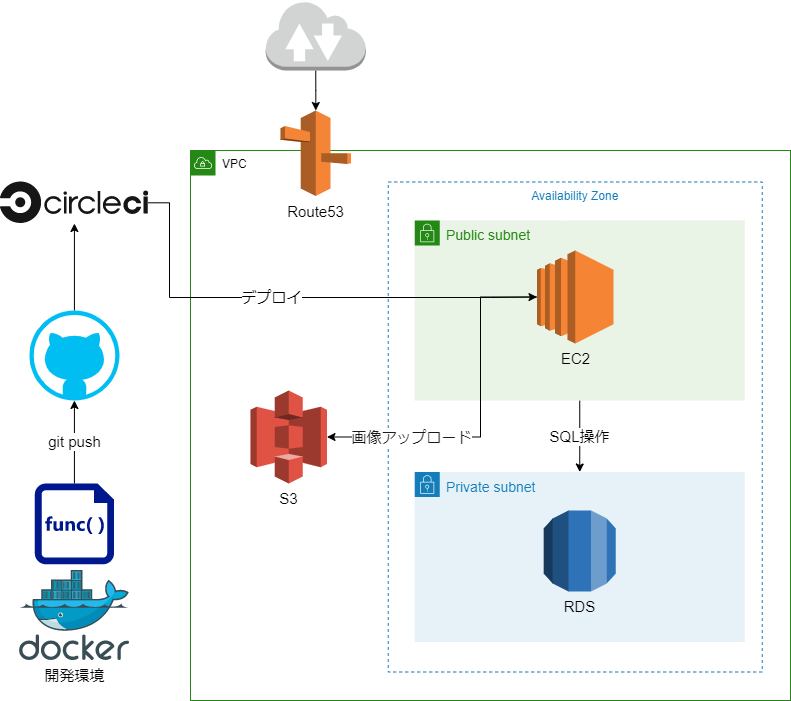

# ゆあるえる

面白い、勉強になる等のサイトを共有するサイトです。
SNS でもあるため、自分が興味のある投稿をするユーザーをフォローして個別の投稿を閲覧することも可能です。

## なぜ作ったのか

自分の気にいったサイト・動画等をより多くの人に見てほしいと考える人は多数いると考え、このサイトを作りました。

## 使用技術

- フロントエンド
  - Typescript
    - React
    - Material-ui
- バックエンド
  - PHP
    - Laravel6.0
- インフラ
  - MySQL
  - Nginx
  - Docker
    - docker-compose
  - AWS
    - VPC
    - EC2
    - RDS
    - Route53
    - S3
  - Circle CI

## インフラ構成図

## 機能一覧

- 認証機能
- 投稿機能
  - CRUD
- いいね機能
- コメント機能
- フォロー機能
- 無限スクロール機能
- 検索機能
- レスポンシブ機能
